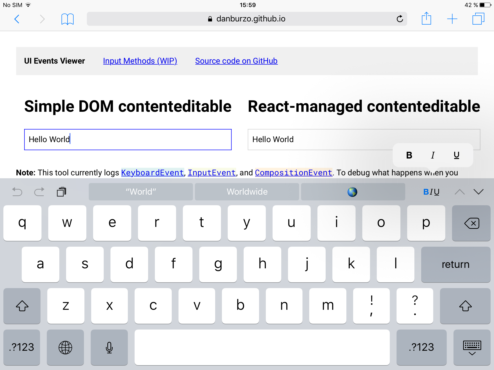
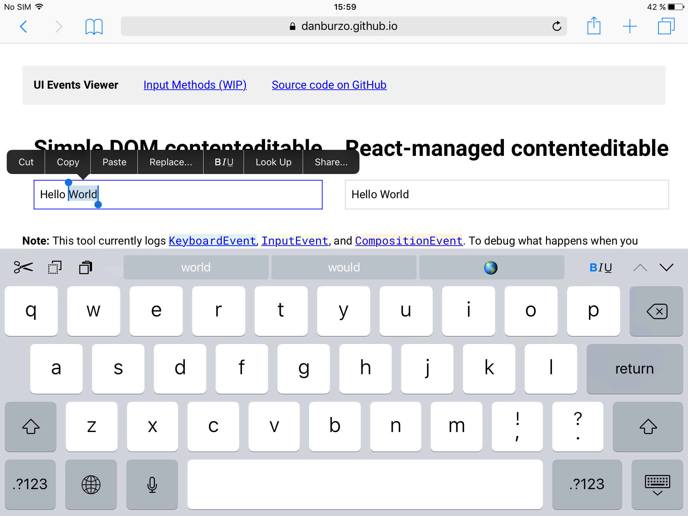

# iOS Rich-Text Editing

iOS offers shortcuts to basic rich-text editing:

## Installation

Rich-text editing controls are available by default to any contenteditable element.

## Notes

`-webkit-user-modify:plain-text` TBD